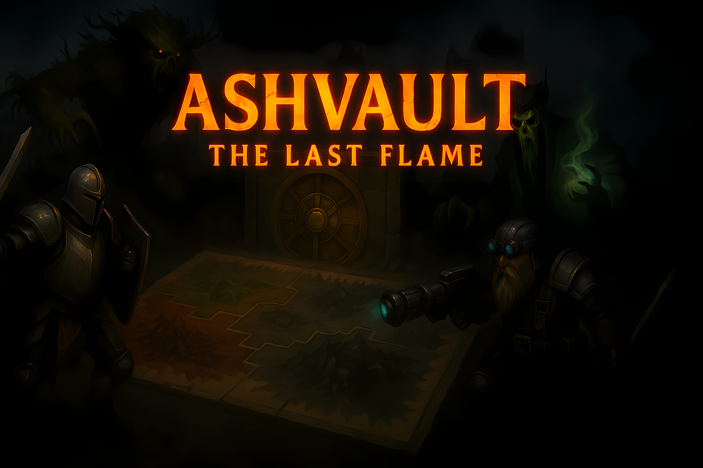

# 🔥 Ashvault – The Last Flame

**Ashvault – The Last Flame** is a web-based, multiplayer online board game set in a world consumed by fire and darkness. Choose your hero from unique factions, fight rivals, and claim the legendary **Last Flame** hidden at the center of the board.

---

## 🎮 Core Gameplay

- **Turn-Based** – players act in a fixed order, only the active player can move or act.  
- **Dice Movement** – movement is determined by rolling a die. The rolled number = the exact spaces moved.  
- **Interactive Board** – valid paths are highlighted after rolling; players click to confirm their move.  

---

## 🗺️ Game Board

- **Structure**: 40 circular tiles in two concentric rings.  
- **Passages**: 4 transition points connect outer and inner rings.  
- **Faction Zones**:
  - **Solaris Guard**  
  - **Eclipse Nomads**  
  - **Ironclaw Horde**  
  - **Voidborn Cult**  
- **Ashvault Core**: the 41st central tile – the ultimate objective.  
- **Unique Tile Names**: every tile has a distinct name for immersion and strategy.  

---

## 👥 Multiplayer & Characters

- **Setup**: enter a player name and choose a unique hero (no duplicates).  
- **Faction-Based Heroes**: 12 starting characters (3 per faction), each with distinct stats and abilities.  
- **Spawn Points**: each hero spawns on a fixed tile in their faction’s zone.  

### 🧬 Stats System

| Stat | Description |
|------|-------------|
| HP   | Health Points |
| ATK  | Attack |
| DEF  | Defense |
| PSY  | Psychic / Mental Power *(not yet implemented)* |
| RES  | Resistance *(not yet implemented)* |

- **Death & Elimination**: if HP ≤ 0, the character is removed from the game.  

---

## 🎒 Inventory System

- Players maintain an inventory of items gained through loot or PvP.  
- Items can modify stats or affect combat outcomes.  

---

## 🃏 Deck System

The game uses **6 modular decks**, stored in separate files:  

### Faction Event Decks (4 total)
- 20 cards per faction  
- On own faction tile: minor negative event  
- On enemy faction tile: major challenge (battle) + loot  

### Item Deck
- 20 equipment cards that modify stats  

### Enemy Deck
- 20 enemy cards used in PvE battles  
- Each card has unique effects  

---

## ⚔️ Combat System

### PvE Combat
- Triggered when a faction event card requires a battle  
- Player draws an enemy card from the **Enemy Deck**  

**Combat Formula (simplified):**

Attack = (d6 + ATK) - Enemy DEF
Defense = (d6 + DEF) - Enemy ATK

- Results determine damage and outcome (victory or defeat).  

---

## 🚀 Development Status

- ✅ Core gameplay  
- ✅ Multiplayer & lobby  
- ✅ Character selection  
- 🚧 Inventory & advanced combat mechanics  
- 🚧 PSY & RES stats  

---

## 📜 License

This project is an original fan-made board game concept.  
All names, factions, and mechanics in **Ashvault – The Last Flame** are original creations.  

